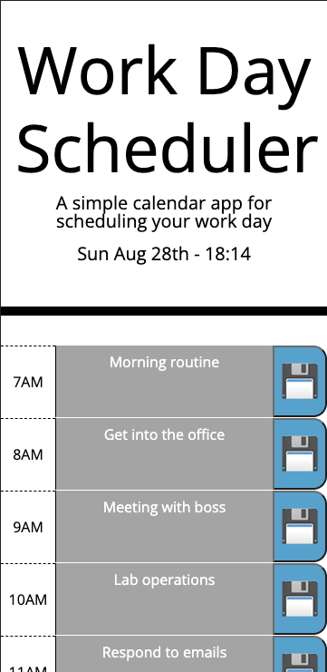

# Day calendar

A basic calendar app to help plan out busy work days.
Time blocks are color coded by their status, and each row has a text area that the user can
fill in event details for. The save button allows you to lock in events and come back to the
page later to check in on your schedule again. Hour block coloring refreshes over time as well.

 Link to deployed page:
 https://gordon-magill.github.io/code_quiz/
 
## Authors

- [@Gordon-Magill](https://github.com/Gordon-Magill/)

